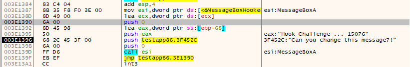

# API Hooking Techniques 

This repostiroty contains some tecniques for Windows API Hooking for research and educational purposes only!

## Ring 3 
The included techniques are: 
- [X] Detours Hook (x64/86) 
- [X] Trampoline Hook (x64/x86)
- [X] Import Address Table (IAT) Hook (x64/x86)
- [X] Export Address Table (EAT) Hook (x64/x86)

#### Notes: 
- Treampoline Hook needs a fix when copying the instruction from the original function into the new function address. The addresses in the instructions must be changed, otherwise the hook won't work. 
- The TestApp is simply a while statement that contains a call into the MessageBoxA function. In TestApp86.exe, and in a rare case, the visual studio optimizer has stored the original API address in the ESI register which makes the IAT hook useless in that case. As a result, I compiled another version after turning off the optimizer (TestApp86OptOff.exe) to validate the hook results! 

- EAT hook won't work for x64 bits because the relative addresses in EAT are 4 bytes for both x32 and x64 bits PE files. As a result, a jump instruction has been created in the same targeted module that is being hooked which will solve the issue. 

#### Example 

